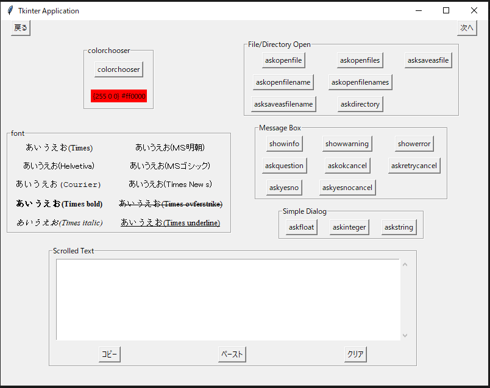
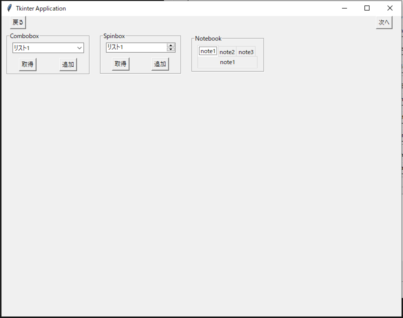
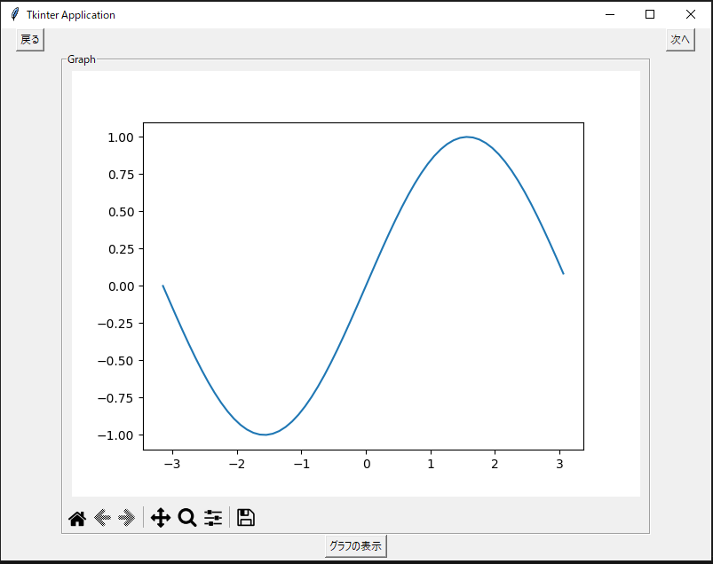
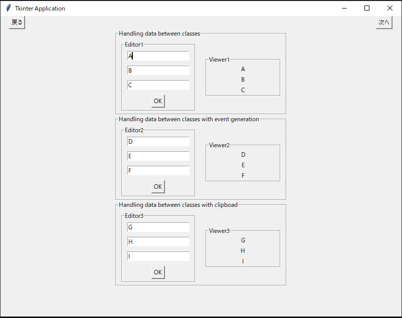
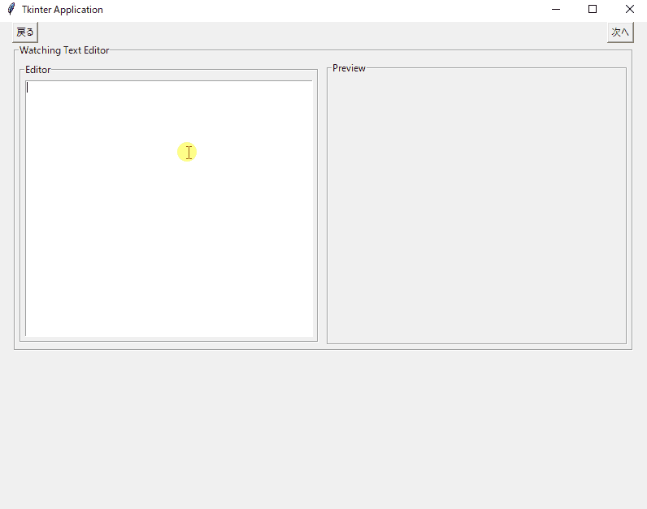
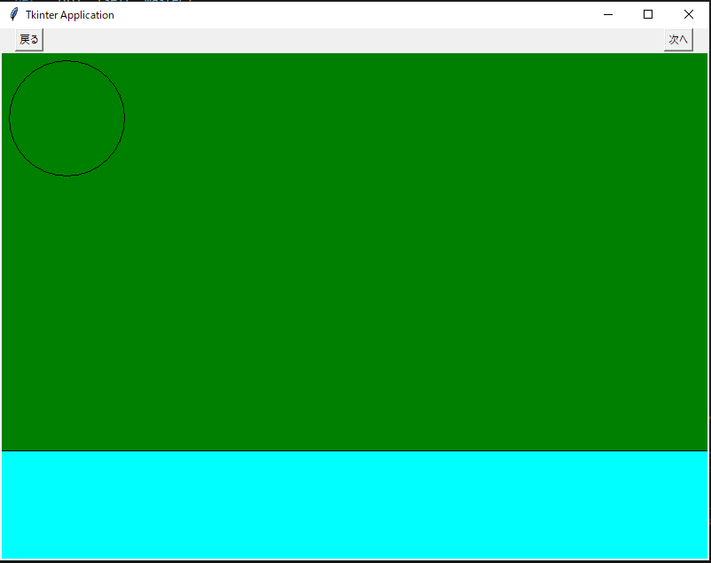
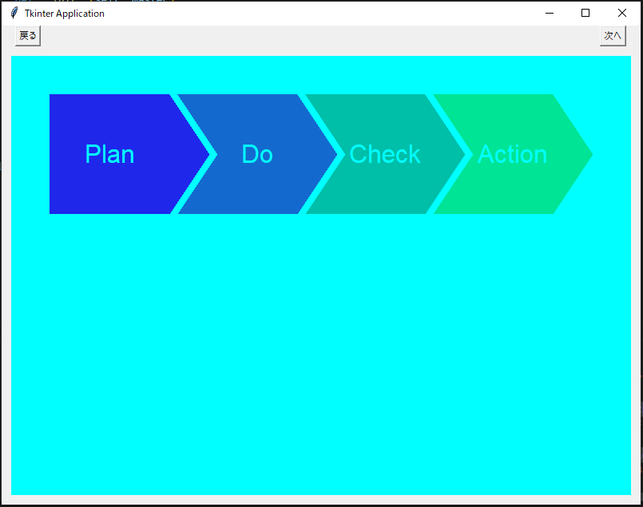

# Tkinter widgets

 Tkinter Widgets for study

## Usage

```
python main.py
```

### Page 1



- colorchooser
- font
- File/DIrectory Open
- Message Box
- Simple Dialog

### Page 2



- Combobox
- Spinbox
- Notebook

### Page 3



- Graph

### Page 4



- Handling text data between classes
- Handling text data between classes with event generation
- Handling text data between classes with clipboard

### Page 5



- Watching text editor

### Page 6



- Canvas

### Page 7



- Arrow bottons with Canvas